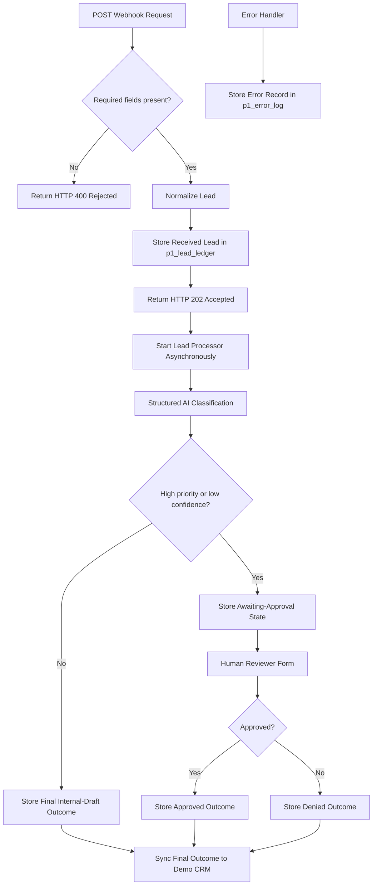

# Secure Lead Intake and Human-Reviewed AI Qualification

> A completed and tested n8n portfolio project demonstrating secure lead intake, structured AI qualification, human approval, duplicate-safe storage, CRM synchronization, and error logging using synthetic data only.

## Business problem

Businesses receive leads from website forms, ads, and other channels. Incoming requests can be incomplete, duplicated, urgent, or require a human decision before any follow-up occurs.

This project demonstrates a safe workflow that validates incoming leads, stores a durable lead record, classifies lead intent using structured AI output, requires human approval for higher-risk cases, and records final outcomes in a synthetic Demo CRM.

## What this project demonstrates

- Webhook-based API intake using HTTP `POST`
- Required-field validation and clear HTTP `400` rejection responses
- HTTP `202 Accepted` responses for valid requests
- Normalized lead data and a stable duplicate key (`leadKey`)
- Duplicate-safe storage with n8n Data Tables
- Structured AI classification: intent, priority, confidence, and reason
- Human approval for high-priority or low-confidence leads
- Google Sheets integration as a synthetic Demo CRM
- Reusable sub-workflows for storage and CRM synchronization
- Error logging with a dedicated n8n error workflow
- Synthetic test fixtures, test documentation, security notes, and an operator runbook

## Workflow overview



## Workflow responsibilities

| Workflow | Responsibility |
|---|---|
| `P1 — Lead Intake API` | Validates webhook requests, normalizes lead data, stores the received lead, returns HTTP `202`, and starts processing asynchronously. |
| `P1 — Lead Processor` | Runs structured AI classification and sends high-priority or low-confidence leads to human review. |
| `P1 — Store Lead` | Upserts lead state into `p1_lead_ledger` using `leadKey`. |
| `P1 — Sync Demo CRM` | Upserts final lead outcomes into a synthetic Google Sheets Demo CRM. |
| `P1 — Error Handler` | Records failed workflow executions in `p1_error_log`. |

## Request contract

### Required fields

| Field | Type | Example |
|---|---|---|
| `fullName` | string | `Sara Ahmed` |
| `email` | string | `sara@example.com` |
| `source` | string | `website` |

### Optional fields

| Field | Type | Example |
|---|---|---|
| `phone` | string | `+249900000000` |
| `language` | string | `en` |
| `message` | string | `I would like to learn more about your services.` |

### Valid request example

```json
{
  "fullName": "Sara Ahmed",
  "email": "sara@example.com",
  "phone": "+249900000000",
  "language": "en",
  "source": "website",
  "message": "I would like to learn more about your services."
}
```

## API behavior

| Situation | API response | Result |
|---|---:|---|
| Required field is missing | `400 Bad Request` | The request is rejected and is not stored or processed. |
| Valid request | `202 Accepted` | The lead is stored and queued for asynchronous processing. |
| Duplicate request | `202 Accepted` | The matching `leadKey` record is updated instead of duplicated. |

Example accepted response:

```json
{
  "status": "accepted",
  "message": "Lead received and queued for processing.",
  "correlationId": "example-execution-id",
  "leadKey": "sara@example.com|website"
}
```

## Lead lifecycle

The n8n Data Table `p1_lead_ledger` is the source of truth for lead status.

```text
received
  ↓
classified_no_external_action
```

or, when human review is required:

```text
received
  ↓
awaiting_human_approval
  ↓
approved_for_simulated_follow_up
```

or:

```text
received
  ↓
awaiting_human_approval
  ↓
review_denied
```

## AI and human-approval controls

The AI classification step returns structured fields only:

```text
intent
priority
aiConfidence
aiReason
```

The workflow routes a lead to human review when either condition is true:

```text
priority = high
```

or:

```text
aiConfidence < 0.80
```

The reviewer can select:

```text
Approved
Denied
```

> The project records a simulated follow-up outcome only. It does not automatically send a customer email, message, payment request, or other external action.

## Testing

The workflow has been tested using synthetic data only.

| Test ID | Scenario | Expected result |
|---|---|---|
| T01 | Valid low-risk lead | HTTP `202`; final internal-draft status is stored; final result is synced to Demo CRM. |
| T02 | Valid high-risk lead | HTTP `202`; lead is stored as `awaiting_human_approval`; reviewer form is required. |
| T03 | Invalid request | HTTP `400`; no lead is stored. |
| T04 | Duplicate delivery | One record per `leadKey`; existing record is updated instead of duplicated. |
| T05 | Reviewer approval | Final status becomes `approved_for_simulated_follow_up`. |
| T06 | Reviewer denial | Final status becomes `review_denied`. |
| T07 | Synthetic failure test | An error record is stored in `p1_error_log`. |

For full test details, see the [Test Matrix](docs/test-matrix.md).

## Repository structure

```text
fixtures/     Synthetic test requests
docs/         Architecture, test plan, security notes, and operator runbook
workflow/     Redacted n8n workflow exports
screenshots/  Redacted test evidence
```

## Documentation

- [Architecture](docs/architecture.md)
- [Test Matrix](docs/test-matrix.md)
- [Security and Privacy](docs/security-and-privacy.md)
- [Operator Runbook](docs/runbook.md)
- [Workflow Export Guidance](workflow/README.md)
- [Screenshot Evidence Guidance](screenshots/README.md)

  ## Visual test evidence

The following redacted screenshots demonstrate the completed workflow using synthetic data only.

- [Valid request — HTTP 202 Accepted](screenshots/01-valid-request-202.png)
- [Invalid request — HTTP 400 Rejected](screenshots/02-invalid-request-400.png)
- [Lead Intake API workflow canvas](screenshots/03-main-workflow-canvas.png)
- [Structured AI classification output](screenshots/04-ai-structured-output.png)
- [Human approval form](screenshots/05-human-approval-form.png)
- [Final approved outcome in the Demo CRM](screenshots/06-final-demo-crm-row.png)
- [Synthetic error-handling evidence](screenshots/07-error-log-test.png)


## Privacy and security

- All names, emails, phone numbers, messages, test requests, and screenshots are synthetic or redacted.
- No employer, client, customer, banking, production, or confidential data is used.
- Credentials are stored in n8n credential storage only.
- No API keys, OAuth tokens, passwords, private webhook URLs, private execution URLs, or credential exports are committed to GitHub.
- The Google Sheets integration uses a personal test account only.
- AI input is treated as untrusted data and is constrained to structured output.
- High-priority or low-confidence leads require human approval before a final outcome is recorded.

## Limitations

This is an independent portfolio demonstration. It is not a production deployment, security audit, compliance certification, service-level agreement, or representation of any employer system.

## Author

Built independently by **Sarah Sabouni**, Software Engineer, as a portfolio demonstration of workflow automation, API integration, AI-assisted business processes, human-in-the-loop design, and operational documentation.
