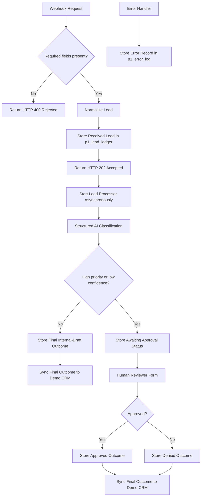

# Architecture

## Overview

This project separates API intake, lead processing, data storage, Demo CRM synchronization, and error handling into small n8n workflows.

## Workflow responsibilities

| Workflow | Responsibility |
|---|---|
| `P1 — Lead Intake API` | Validates incoming webhook requests, stores the received lead, returns HTTP `202`, and starts processing asynchronously. |
| `P1 — Lead Processor` | Runs structured AI classification and routes high-risk or low-confidence leads to human review. |
| `P1 — Store Lead` | Upserts lead state into `p1_lead_ledger`. |
| `P1 — Sync Demo CRM` | Upserts final lead outcomes into the synthetic Google Sheets Demo CRM. |
| `P1 — Error Handler` | Records failed workflow executions in `p1_error_log`. |

## Data flow

- `p1_lead_ledger` is the source of truth.
- Google Sheets is a synthetic Demo CRM and receives final outcomes only.
- AI output is structured and cannot send customer messages.
- High-priority or low-confidence cases require a human decision.
- All data is synthetic or redacted.
